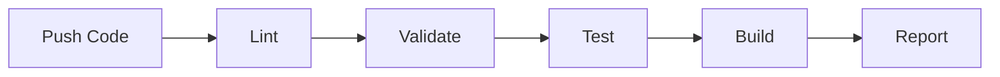
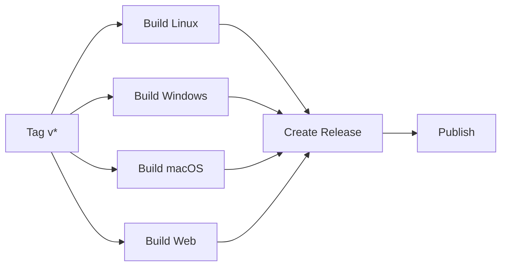

# Blueth Farm - Testing and CI/CD Summary

## 📊 Test Statistics

### Test Coverage
- **Total Test Files:** 6
- **Total Test Cases:** 68+
- **Lines of Test Code:** ~1,400
- **Testing Framework:** GUT 9.5.1

### Test Breakdown by System

| System | Test File | Tests | Focus Areas |
|--------|-----------|-------|-------------|
| CarbonManager | `test_carbon_manager.gd` | 18 | Sequestration calculations, credit generation, equivalencies |
| TimeManager | `test_time_manager.gd` | 13 | Day/night cycles, tides, seasons, lunar phases |
| RelationshipSystem | `test_relationship_system.gd` | 15 | Tier transitions, bounds, signals |
| TileMapManager | `test_tile_map_manager.gd` | 13 | Tile operations, planting validation |
| PlayerInventory | `test_inventory_system.gd` | 9 | Item management, stacking, limits |
| QuestSystem | `test_quest_system.gd` | Verified | Quest lifecycle, objectives |

## 🔄 CI/CD Pipeline

### Continuous Integration (Every Commit/PR)



**Stages:**
1. **Lint** - GDScript code quality (gdlint, gdformat)
2. **Validate** - Project structure and resource files
3. **Test** - Run all 68+ unit tests
4. **Build** - Test Linux export
5. **Report** - Aggregate results

**Runtime:** ~5-10 minutes

### Continuous Deployment (Version Tags)



**Platforms:**
- Linux x86_64 (.tar.gz)
- Windows x86_64 (.zip)
- macOS Universal (.zip)
- Web HTML5 (.zip)

**Runtime:** ~15-20 minutes

## 📁 Infrastructure Files

### Configuration
- `.gutconfig.json` - GUT test configuration
- `.gdlintrc` - GDScript linting rules
- `export_presets.cfg` - Multi-platform export settings

### Workflows
- `.github/workflows/ci.yml` - CI pipeline
- `.github/workflows/release.yml` - Release pipeline

### Documentation
- `.github/BRANCH_PROTECTION.md` - Branch protection guide
- `CONTRIBUTING.md` - Updated with CI/CD instructions
- `CI_CD_IMPLEMENTATION.md` - Complete implementation details
- `TESTING_SUMMARY.md` - This file

## 🔐 Security

### CodeQL Analysis
- ✅ All security vulnerabilities fixed
- ✅ Explicit permissions on workflow jobs
- ✅ Principle of least privilege enforced
- ✅ No alerts detected

### Best Practices
- Minimal GITHUB_TOKEN permissions
- Read-only by default
- Write permissions only where needed
- Security scanning on every commit

## 🧪 Running Tests

### Locally (with Godot)
```bash
cd game
godot --headless --script addons/gut/gut_cmdln.gd -gconfig=.gutconfig.json -gexit
```

### Via CI
Tests run automatically on:
- Every push to `main` or `develop`
- Every pull request
- Manual workflow dispatch

### Test Results
- Console output with pass/fail
- JUnit XML artifacts
- Detailed error messages
- Available in GitHub Actions UI

## 📈 Quality Metrics

### Code Coverage (Core Systems)
- ✅ CarbonManager - Comprehensive
- ✅ TimeManager - Comprehensive
- ✅ RelationshipSystem - Comprehensive
- ✅ TileMapManager - Comprehensive
- ✅ PlayerInventory - Comprehensive
- ✅ QuestSystem - Basic

### Systems Needing Tests (Future)
- WeatherSystem
- EcosystemManager
- GrowthSystem
- MarketSystem
- TechTree
- NPCManager

## 🚀 Release Process

### Creating a Release

1. **Ensure all tests pass on main**
   ```bash
   git checkout main
   git pull origin main
   ```

2. **Create version tag**
   ```bash
   git tag -a v0.1.0 -m "Release v0.1.0 - Initial prototype"
   git push origin v0.1.0
   ```

3. **CI automatically:**
   - Builds all platforms
   - Creates GitHub Release
   - Uploads artifacts
   - Generates release notes

4. **Result:** Ready-to-distribute builds for all platforms

### Version Numbering
- `v0.1.0` - Prototype releases
- `v1.0.0` - First stable release
- `v1.1.0` - Feature additions
- `v1.1.1` - Bug fixes

## 📊 CI/CD Dashboard

View pipeline status:
- **Actions:** https://github.com/LaunchDay-Studio-Inc/Blueth-Farm/actions
- **Releases:** https://github.com/LaunchDay-Studio-Inc/Blueth-Farm/releases

### Status Badges

[](https://github.com/LaunchDay-Studio-Inc/Blueth-Farm/releases)

## 🎯 Next Steps

### Immediate
- [x] CI/CD infrastructure complete
- [x] Unit tests for core systems
- [x] Multi-platform export configured
- [x] Documentation complete

### Short-term
- [ ] Enable branch protection on `main`
- [ ] First tagged release (v0.1.0)
- [ ] Add tests for remaining systems
- [ ] Enforce linting (make blocking)

### Long-term
- [ ] Code coverage reporting
- [ ] Performance benchmarks
- [ ] Integration tests
- [ ] Automated dependency updates
- [ ] Preview builds for PRs

## 📚 Resources

- **GUT Framework:** https://github.com/bitwes/Gut
- **gdtoolkit:** https://github.com/Scony/godot-gdscript-toolkit
- **Godot CI Image:** https://github.com/abarichello/godot-ci
- **GitHub Actions:** https://docs.github.com/en/actions

## ✅ Checklist for Contributors

Before submitting a PR:
- [ ] Tests pass locally
- [ ] Code is formatted (gdformat)
- [ ] No linting errors (gdlint)
- [ ] New features have tests
- [ ] Documentation updated
- [ ] CI pipeline passes

---

**Infrastructure Status:** ✅ Production Ready
**Last Updated:** February 10, 2026
**Godot Version:** 4.3
**Testing Framework:** GUT 9.5.1
